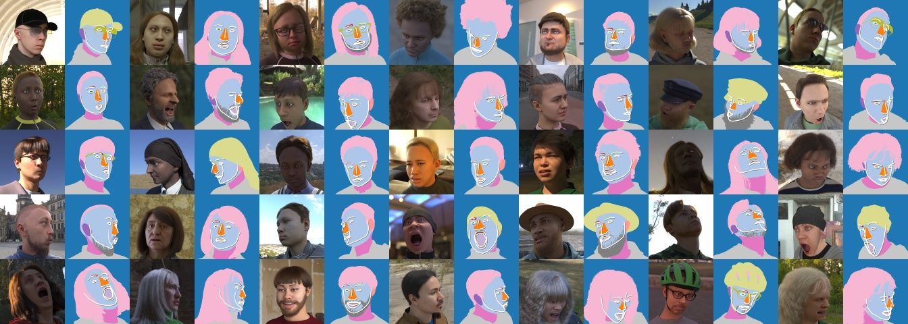

# The Face Synthetics dataset

Face Synthetics dataset is a collection of diverse synthetic face images with ground truth labels.

It was introduced in our paper [**Fake It Till You Make It: Face analysis in the wild using synthetic data alone**](https://microsoft.github.io/FaceSynthetics/).

Our dataset contains:
- 100,000 images of faces at 512 x 512 pixel resolution
- 70 standard facial landmark annotations
- per-pixel semantic class anotations

It can be used to train machine learning systems for face-related tasks such as landmark localization and face parsing, showing that synthetic data can both match real data in accuracy as well as open up new approaches where manual labelling would be impossible.

Some images also include hands and off-center distractor faces in addition to primary faces centered in the image.

The Face Synthetics dataset can be used for **non-commercial** research, and is licensed under the license found in [LICENSE.txt](LICENSE.txt).

## Downloading the dataset

A sample dataset with 100 images (34MB) can be downloaded from [here](https://facesyntheticspubwedata.blob.core.windows.net/iccv-2021/dataset_100.zip)

A sample dataset with 1000 images (320MB) can be downloaded from [here](https://facesyntheticspubwedata.blob.core.windows.net/iccv-2021/dataset_1000.zip)

A full dataset of 100,000 images (32GB) can be downloaded from [here](https://facesyntheticspubwedata.blob.core.windows.net/iccv-2021/dataset_100000.zip)

## Dataset layout

The Face Synthetics dataset is a single .zip file containing color images, segmentation images, and 2D landmark coordinates in a text file.

```
dataset.zip
├── {frame_id}.png        # Rendered image of a face
├── {frame_id}_seg.png    # Segmentation image, where each pixel has an integer value mapping to the categories below
├── {frame_id}_ldmks.txt  # Landmark annotations for 70 facial landmarks (x, y) coordinates for every row
```

Our landmark annotations follow the 68 landmark scheme from [iBUG](https://ibug.doc.ic.ac.uk/resources/300-W/) with two additional points for the pupil centers.
Please note that our 2D landmarks are projections of 3D points and do not follow the outline of the face/lips/eyebrows in the way that is common from manually annotated landmarks.
They can be thought of as an "x-ray" version of 2D landmarks.

Each pixel in the segmentation image will belong to one of the following classes:
```
BACKGROUND = 0
SKIN = 1
NOSE = 2
RIGHT_EYE = 3
LEFT_EYE = 4
RIGHT_BROW = 5
LEFT_BROW = 6
RIGHT_EAR = 7
LEFT_EAR = 8
MOUTH_INTERIOR = 9
TOP_LIP = 10
BOTTOM_LIP = 11
NECK = 12
HAIR = 13
BEARD = 14
CLOTHING = 15
GLASSES = 16
HEADWEAR = 17
FACEWEAR = 18
IGNORE = 255
```

Pixels marked as `IGNORE` should be ignored during training.

Notes:
* Opaque eyeglass lenses are labeled as `GLASSES`, while transparent lenses as the class behind them.
* For bushy eyebrows, a few eyebrow pixels may extend beyond the boundary of the face. These pixels are labelled as `IGNORE`.

## Disclaimer

Some of our rendered faces may be close in appearance to the faces of real people.  Any such similarity is naturally unintentional, as it would be in a dataset of real images, where people may appear similar to others unknown to them.


## Generalization to real data

For best results, we suggest you follow the methodology described in our [paper](https://arxiv.org/abs/2109.15102) (citation below). Especially note the need for 1) data augmentation; 2) use of a translation layer if evaluating on real data benchmarks that contain different types of annotations.

Our dataset strives to be as diverse as possible and generalizes to real test data as described in the paper. However, you may encounter situations that it does not cover and/or where generalization is less successful. We recommend that machine learning practitioners always test models on real data that is representative of the target deployment scenario.


## Citation

If you use the Face Synthetics Dataset your research, please cite the following [paper](https://arxiv.org/abs/2109.15102):


```
@misc{wood2021fake,
    title={Fake It Till You Make It: Face analysis in the wild using synthetic data alone},
    author={Erroll Wood and Tadas Baltru\v{s}aitis and Charlie Hewitt and Sebastian Dziadzio and Matthew Johnson and Virginia Estellers and Thomas J. Cashman and Jamie Shotton},
    year={2021},
    eprint={2109.15102},
    archivePrefix={arXiv},
    primaryClass={cs.CV}
}
```
